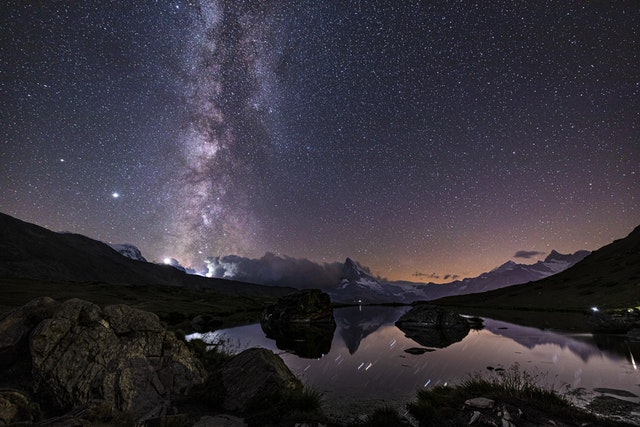

# Art attribution

## Logo Vector Art
### Gordon Johnson 
- [pixabay profile](https://pixabay.com/users/gdj-1086657/) 
- [vector link](https://pixabay.com/vectors/birds-landscape-silhouette-trees-1302194/)

## Main Image
### Mikhail Nilov
- [pexels profile](https://www.pexels.com/@mikhail-nilov/)
- [image link](https://www.pexels.com/photo/an-aerial-photography-of-a-beach-near-the-rock-formation-with-green-trees-6965014/)

    

## Information Section Photos
### Stein Egil Liland
- [pexels profile](https://www.pexels.com/@therato/)
- [image link](https://www.pexels.com/photo/scenic-view-of-snow-capped-mountains-during-night-3408744/)

### Roberto Nickson
- [pexels profile](https://www.pexels.com/@rpnickson/)
- [image link](https://www.pexels.com/photo/brown-mountains-2559941/)

### Janik Butz
- [pexels profile](https://www.pexels.com/@janikbutz/)
- [image link](https://www.pexels.com/photo/body-of-water-near-mountain-under-starry-night-5366526/)

### Quang Nguyen Vinh
- [pexels profile](https://www.pexels.com/@quang-nguyen-vinh-222549/)
- [image link](https://www.pexels.com/photo/2-people-on-the-boat-2166711/)

